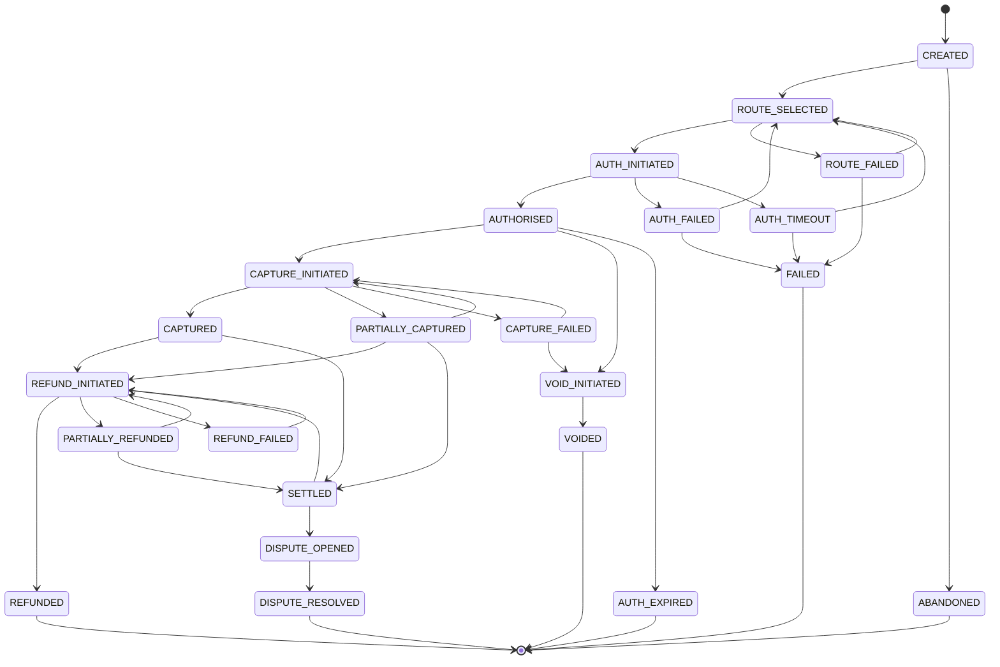

# Transaction State Machine

## Why a State Machine?

A payment's status cannot be a plain string column that any code can set to
any value. A bug in a refund handler could otherwise set a transaction from
`CREATED` directly to `REFUNDED`, skipping the states that prove money was
ever actually captured. This would create a financial record that doesn't
correspond to anything that happened.

The state machine solves this by making transitions explicit and centrally
enforced. Every transition request goes through one function:
`TransactionStateMachine.transition()`. If the requested move isn't in the
allowed list for the current state, it's rejected immediately and the
database is left untouched — no partial writes, no corrupted state.

## All States

| State | Meaning |
|---|---|
| `CREATED` | Transaction record exists, no gateway contacted yet |
| `ROUTE_SELECTED` | Routing algorithm picked a gateway |
| `ROUTE_FAILED` | No healthy gateway was available |
| `AUTH_INITIATED` | Authorisation request sent to gateway |
| `AUTHORISED` | Bank approved and placed a hold on funds (not yet captured) |
| `AUTH_FAILED` | Bank declined the authorisation |
| `AUTH_TIMEOUT` | Gateway did not respond within timeout window |
| `AUTH_EXPIRED` | Authorisation hold expired before capture (~7 days) |
| `CAPTURE_INITIATED` | Capture request sent to gateway |
| `CAPTURED` | Funds successfully moved — the "happy path" success state |
| `PARTIALLY_CAPTURED` | Only part of the authorised amount was captured |
| `CAPTURE_FAILED` | Capture attempt failed after a successful authorisation |
| `VOID_INITIATED` | Request sent to release an authorisation hold |
| `VOIDED` | Authorisation hold successfully released |
| `REFUND_INITIATED` | Refund request submitted to gateway |
| `REFUNDED` | Refund fully processed |
| `PARTIALLY_REFUNDED` | Partial refund processed |
| `REFUND_FAILED` | Refund attempt was rejected by the gateway |
| `SETTLED` | Gateway confirmed funds reached the merchant's bank account |
| `DISPUTE_OPENED` | Customer raised a chargeback |
| `DISPUTE_RESOLVED` | Chargeback resolved |
| `FAILED` | Terminal. Max retries exceeded or hard decline |
| `ABANDONED` | Terminal. User left checkout before any gateway was contacted |

## Terminal States

`FAILED`, `REFUNDED`, `ABANDONED`, `VOIDED`, `AUTH_EXPIRED`, and
`DISPUTE_RESOLVED` are terminal — no further transitions are allowed from
them. A new payment attempt after a terminal state always creates a **new**
transaction with its own ID, never reuses the old one.

## State Diagram

## Key Implementation Decisions

1. **Authorisation and Capture are separate states.** A gateway can succeed at
   authorisation but fail at capture — treating these as one step would lose
   that distinction and make debugging payment issues much harder.

2. **Every transition is logged immutably.** The `transaction_state_logs`
   table is insert-only. Combined with the state machine's enforcement, this
   gives a complete, tamper-evident audit trail for every transaction — a
   requirement for financial systems, not just a nice-to-have.

3. **Retries route through `ROUTE_SELECTED`, not directly to the previous
   gateway.** When `AUTH_FAILED` or `AUTH_TIMEOUT` occurs, the transition goes
   back to `ROUTE_SELECTED` so the routing algorithm can pick a *different*
   gateway based on current health scores — this is what enables automatic
   failover.

4. **Invalid transitions fail loudly and safely.** `transition()` raises
   `InvalidStateTransitionException` with the current state and the full list
   of valid next states, rather than silently ignoring the request or
   corrupting data.

## Implementation

See `app/services/state_machine.py` for the `VALID_TRANSITIONS` rulebook and
the `TransactionStateMachine` class. Tested in `tests/test_state_machine.py`
(16 tests covering valid paths, invalid rejections, and terminal state
enforcement).